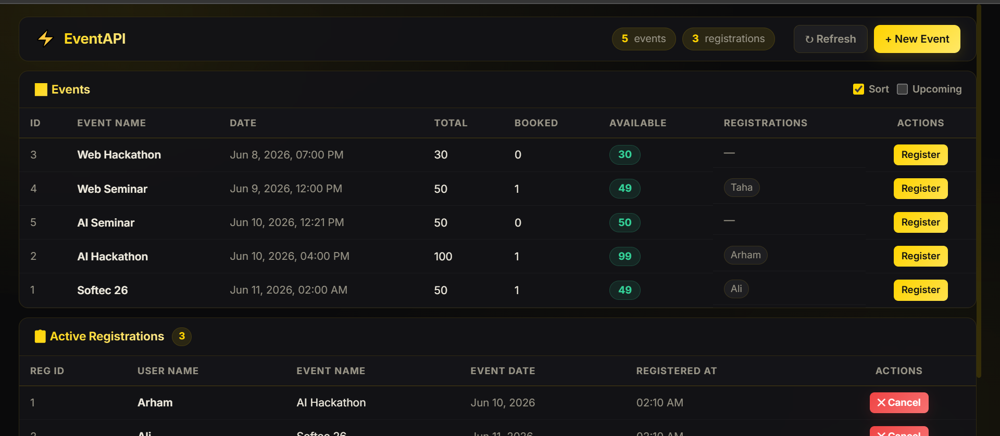
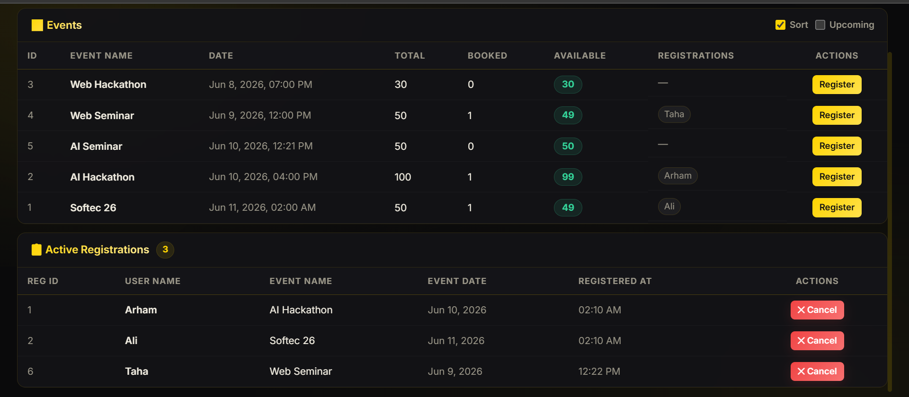

# B0626---Arham-Zeeshan---Innovaxel---Backend-Development-Intern

An event registration system built with Django REST Framework and a React frontend. It allows users to create events, register for events, view active registrations, and cancel registrations when needed.

## Screenshots

The attached screenshots are included below from `backend/docs/screenshots/`:

These images show the event list with totals, booked seats, available seats, and registration chips, plus the active registrations table with cancel actions.

## Backend Overview

The backend lives in `backend/` and uses:

- Django for the project structure and database models.
- Django REST Framework for API views and serializers.
- SQLite as the local database.

### Core Rules

- Event names must be unique.
- Event seat count must be greater than zero.
- Event dates must be in the future.
- A user can register for the same event only once.
- Seats are checked before creating a registration, so full events reject new registrations.

## Data Models

### Event

Stores the event catalog.

- `Name`: unique event title.
- `TotalSeats`: total capacity for the event.
- `EventDate`: scheduled date and time.

### User

Stores attendee names.

- `Name`: user display name.

### Register

Stores one registration record per user/event pair.

- `RegisteredUser`: foreign key to `User`.
- `RegisteredEvent`: foreign key to `Event`.
- `TimeStamp`: time when the registration was created.

The model also enforces a unique constraint on `RegisteredUser` and `RegisteredEvent` so the same person cannot register twice for the same event.

## API Endpoints

The project exposes the API both at `/` and `/api/` because both paths include the same URL configuration.

| Method | Path | Description |
| --- | --- | --- |
| GET | `/` | Returns the event list. Supports query params for sorting and upcoming-only filtering. |
| GET | `/api/` | Same as `/`. Returns the event list. |
| POST | `/create-event/` | Creates a new event. |
| POST | `/api/create-event/` | Same create event endpoint under the API prefix. |
| POST | `/register-event/` | Registers a user for an event. |
| POST | `/api/register-event/` | Same register endpoint under the API prefix. |
| GET | `/registrations/` | Lists all active registrations. |
| GET | `/api/registrations/` | Same registrations endpoint under the API prefix. |
| DELETE | `/registrations/<id>/` | Cancels a registration by registration ID. |
| DELETE | `/api/registrations/<id>/` | Same cancel endpoint under the API prefix. |

### Query Parameters

The event list accepts these optional query parameters:

- `sort=true` sorts events by `EventDate`.
- `upcoming=true` filters to future events only.

### Request Notes

- `POST /create-event/` expects `Name`, `TotalSeats`, and `EventDate`.
- `POST /register-event/` expects `UserName` and `RegisteredEvent`.
- `DELETE /registrations/<id>/` removes a registration record and frees the seat.

### Response Behavior

- Empty event queries return `No Events Available Right Now` with a `404` status.
- Empty registration lists return `No Active Registrations` with a `404` status.
- Duplicate registrations return a validation error.
- Full events return `Sorry! Seats are full for this event`.

## Frontend Notes

The React app in `frontend/` calls the API at `/api` and renders:

- an event table with seat counts and registration chips,
- a registration list with cancel actions,
- a create-event form,
- sort and upcoming filters.

## Quick Run

Backend:

1. Install dependencies for the Django project.
2. Run migrations.
3. Start the development server.

Frontend:

1. Install dependencies in `frontend/`.
2. Start the Vite dev server.

If you want, I can also turn this into a fuller project README with setup commands, environment requirements, and example API requests.
